# protein

**Keywords**: Statistical modeling, deep learning, bio-statistics, predictive analysis

## Introduction
Determining the protein content from multiple grains using near-infrared spectroscopy, statistical modeling and deep learning algorithms. 

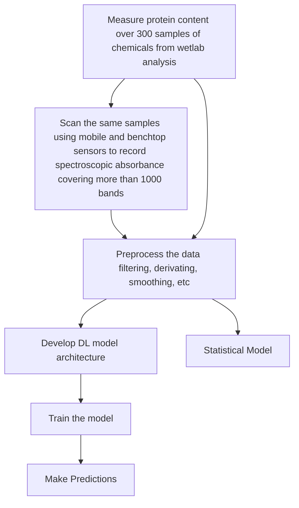
 

## Analysis and Metrics:
- Conducted protein content analysis in various chemicals using predictive analysis and spectroscopy techniques.
- Assembled a dataset of 1000+ bands using mobile and benchmark sensors to measure spectroscopic absorbance.
- Applied Multiplicative Scatter correction and Standard Normal Variate (SNV) correction to preprocess the data.
- Utilized convolution and Savitzky-Golay filtering to remove linear trends and smooth the data for further analysis.
- Developed a deep belief statistical model, achieving an \textbf{R2 value of 0.91 with just 300 wetlab samples.}

## Packages and Technologies used:

- mysql-connector-python: Connecting database to the models
- Keras: Developing Deep Learning Models
- Opencv: Real time computer vision library
- Tensorflow: Developing Deep learning models
- Matplotlib: Data visualization
- Pandas: Data Manipulation and organisation [Pandas](https://pandas.pydata.org/)
- Scikit-Learn: Analysis [Scikit-Learn](https://scikit-learn.org/stable/)

## Usage:
- Install the dependencies:

| Dependency      | Installation commands |
| ----------- | ----------- |
| mysql      | pip install mysql-connector-python       |
| pandas   | pip install pandas        |
| matplotlib   | pip install matplotlib        |
| Opencv | pip install opencv-python |
| Tensorflow | python3 -m pip install tensorflow |

Both the files to be used has been provded as a Jupyter Notebook file, to use it:
- Run the cells in order 

(or)

`jupyter nbconvert --to python notebook.ipynb`
and run  `python3 notebook.py`

## Outputs:
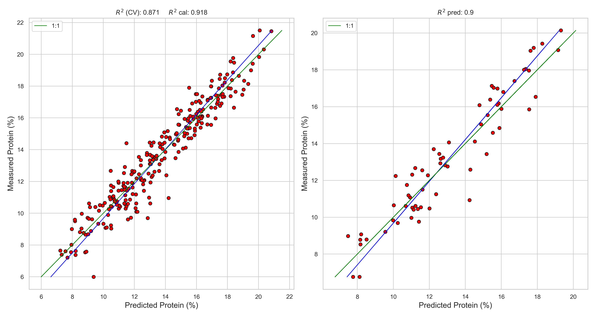
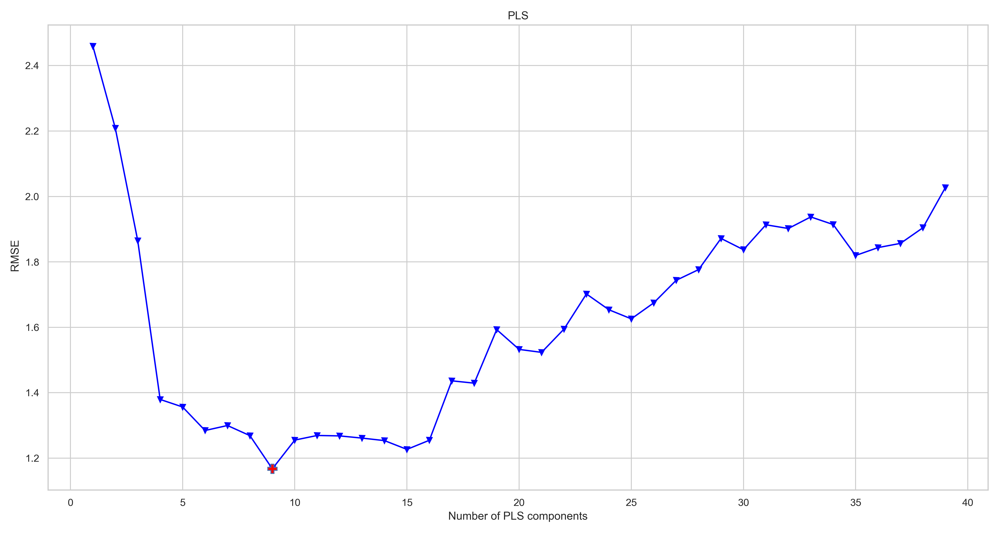
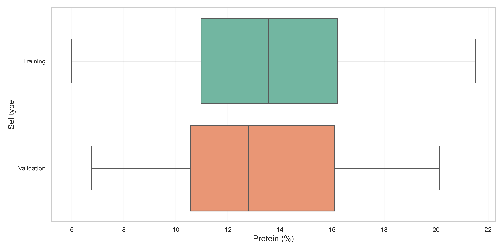
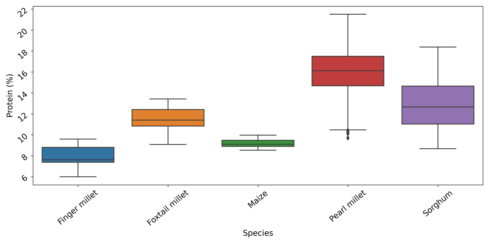
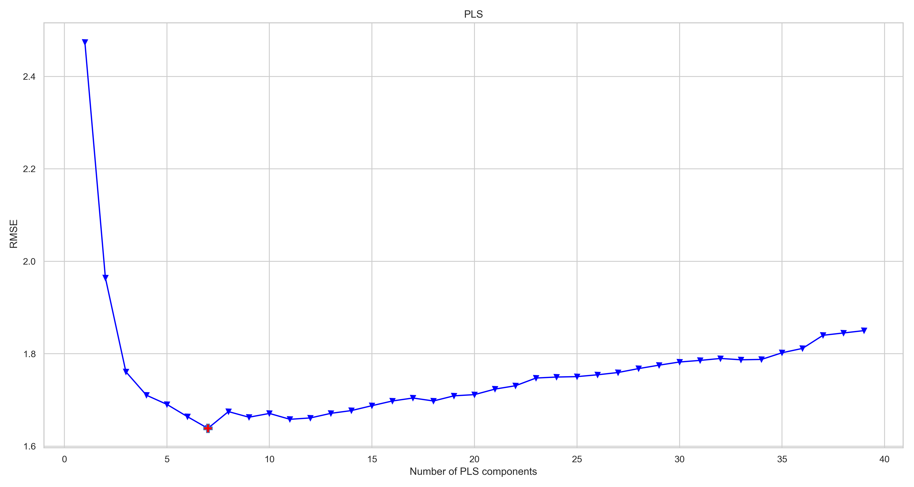
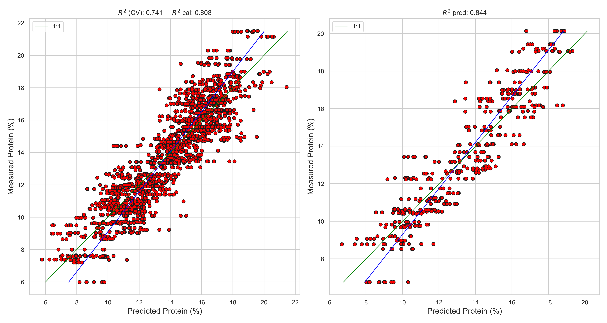
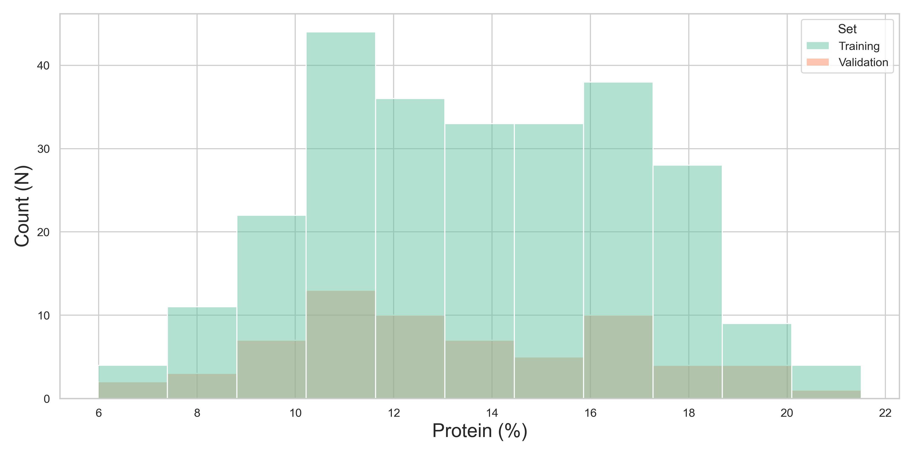
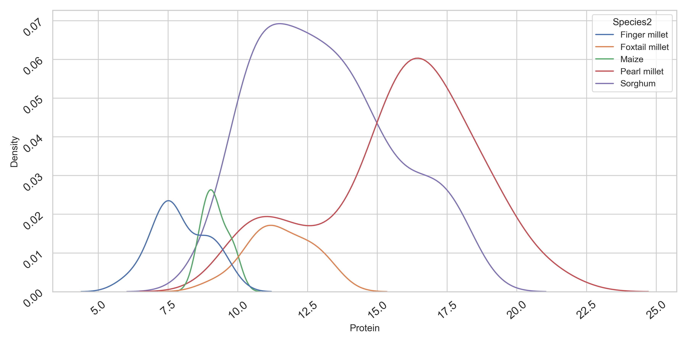
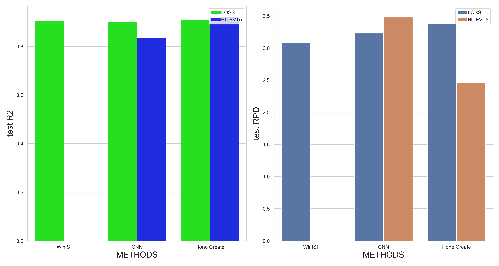
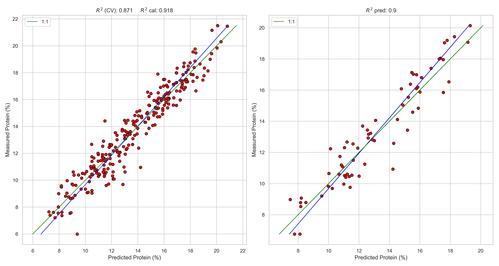
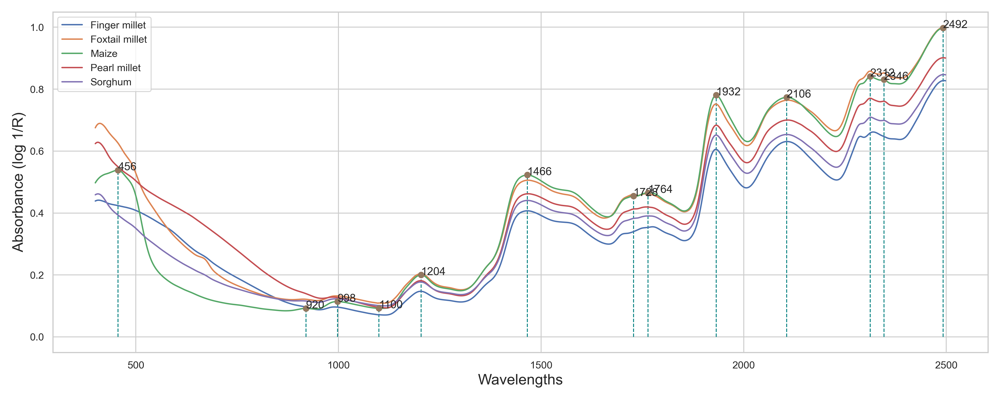

## Contributing
1. Fork it (<https://github.com/yourname/yourproject/fork>)
2. Create your feature branch (`git checkout -b feature/fooBar`)
3. Commit your changes (`git commit -am 'Add some fooBar'`)
4. Push to the branch (`git push origin feature/fooBar`)
5. Create a new Pull Request
